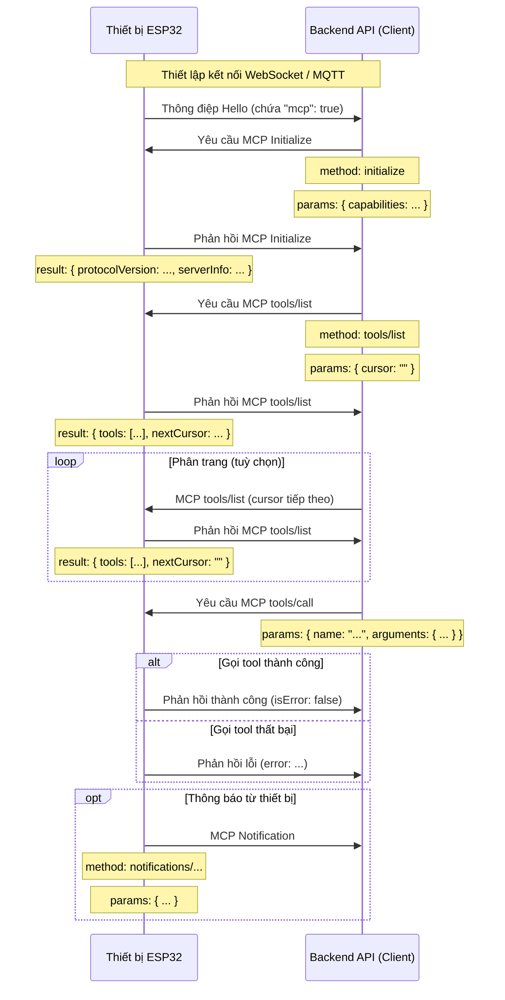

# Luồng tương tác MCP (Model Context Protocol)

LƯU Ý: Tài liệu này được hỗ trợ bởi AI. Khi triển khai dịch vụ backend, hãy đối chiếu mã nguồn để xác nhận chi tiết!

Trong dự án này, giao thức MCP dùng cho việc trao đổi giữa API backend (khách hàng MCP) và thiết bị ESP32 (máy chủ MCP), cho phép backend phát hiện và gọi các chức năng (tool) mà thiết bị cung cấp.

## Định dạng giao thức

Theo mã nguồn (`main/protocols/protocol.cc`, `main/mcp_server.cc`), thông điệp MCP được đóng gói trong phần thân của giao thức truyền thông gốc (WebSocket hoặc MQTT). Bên trong nó tuân thủ chuẩn [JSON-RPC 2.0](https://www.jsonrpc.org/specification).

Ví dụ cấu trúc thông điệp tổng quát:

```json
{
  "session_id": "...", // ID phiên
  "type": "mcp",       // Loại thông điệp, luôn là "mcp"
  "payload": {         // Phần tải JSON-RPC 2.0
    "jsonrpc": "2.0",
    "method": "...",   // Tên phương thức (vd: "initialize", "tools/list", "tools/call")
    "params": { ... }, // Tham số phương thức (đối với request)
    "id": ...,         // ID yêu cầu (dùng cho request và response)
    "result": { ... }, // Kết quả khi thành công (success response)
    "error": { ... }   // Thông tin lỗi (error response)
  }
}
```

Trong đó `payload` là thông điệp JSON-RPC 2.0 chuẩn:

- `jsonrpc`: Chuỗi cố định "2.0".
- `method`: Tên phương thức được gọi (đối với request).
- `params`: Tham số, thường là đối tượng.
- `id`: Định danh request do client cung cấp, server phản hồi nguyên trạng để ghép cặp.
- `result`: Giá trị trả về khi thực thi thành công.
- `error`: Thông tin lỗi khi thực thi thất bại.

## Trình tự tương tác và thời điểm gửi

Giao thức MCP tập trung vào việc backend phát hiện và gọi các "tool" trên thiết bị.

1. **Thiết lập kết nối và thông báo năng lực**

   - **Khi nào:** Sau khi thiết bị khởi động và kết nối thành công tới backend.
   - **Bên gửi:** Thiết bị.
   - **Thông điệp:** Thiết bị gửi thông điệp `hello` của giao thức nền tới backend, trong đó liệt kê các năng lực, ví dụ hỗ trợ MCP (`"mcp": true`).
   - **Ví dụ** (không phải payload MCP, mà là thông điệp của giao thức nền):
     ```json
     {
       "type": "hello",
       "version": ...,
       "features": {
         "mcp": true,
         ...
       },
       "transport": "websocket", // hoặc "mqtt"
       "audio_params": { ... },
       "session_id": "..." // thiết bị có thể đặt sau khi nhận hello từ server
     }
     ```

2. **Khởi tạo phiên MCP**

   - **Khi nào:** Backend nhận được `hello`, xác nhận thiết bị hỗ trợ MCP và gửi yêu cầu đầu tiên.
   - **Bên gửi:** Backend (client).
   - **Phương thức:** `initialize`
   - **Thông điệp (payload MCP):**

     ```json
     {
       "jsonrpc": "2.0",
       "method": "initialize",
       "params": {
         "capabilities": {
           // Năng lực của client, tuỳ chọn

           // Ví dụ năng lực thị giác camera
           "vision": {
             "url": "...", // URL xử lý ảnh (phải là HTTP, không phải WebSocket)
             "token": "..." // Token truy cập URL
           }

           // ... năng lực khác
         }
       },
       "id": 1
     }
     ```

   - **Thời điểm phản hồi của thiết bị:** Khi xử lý xong yêu cầu `initialize`.
   - **Payload phản hồi:**
     ```json
     {
       "jsonrpc": "2.0",
       "id": 1,
       "result": {
         "protocolVersion": "2024-11-05",
         "capabilities": {
           "tools": {} // Không liệt kê chi tiết, cần gọi tools/list
         },
         "serverInfo": {
           "name": "...", // Tên thiết bị (BOARD_NAME)
           "version": "..." // Phiên bản firmware
         }
       }
     }
     ```

3. **Lấy danh sách tool của thiết bị**

   - **Khi nào:** Backend cần biết các chức năng cụ thể mà thiết bị hỗ trợ.
   - **Bên gửi:** Backend (client).
   - **Phương thức:** `tools/list`
   - **Payload yêu cầu:**
     ```json
     {
       "jsonrpc": "2.0",
       "method": "tools/list",
       "params": {
         "cursor": "" // Dùng cho phân trang, lần đầu để rỗng
       },
       "id": 2
     }
     ```
   - **Payload phản hồi của thiết bị:**
     ```json
     {
       "jsonrpc": "2.0",
       "id": 2,
       "result": {
         "tools": [
           {
             "name": "self.get_device_status",
             "description": "...",
             "inputSchema": { ... }
           },
           {
             "name": "self.audio_speaker.set_volume",
             "description": "...",
             "inputSchema": { ... }
           }
           // ... các tool khác
         ],
         "nextCursor": "..." // Nếu cần phân trang, cung cấp cursor cho lần gọi tiếp theo
       }
     }
     ```
   - **Xử lý phân trang:** Nếu `nextCursor` không rỗng, client phải gọi lại `tools/list` với giá trị `cursor` vừa nhận.

4. **Gọi tool của thiết bị**

   - **Khi nào:** Backend muốn thực thi một chức năng cụ thể.
   - **Bên gửi:** Backend (client).
   - **Phương thức:** `tools/call`
   - **Payload yêu cầu:**
     ```json
     {
       "jsonrpc": "2.0",
       "method": "tools/call",
       "params": {
         "name": "self.audio_speaker.set_volume",
         "arguments": {
           "volume": 50
         }
       },
       "id": 3
     }
     ```
   - **Phản hồi khi thành công:**
     ```json
     {
       "jsonrpc": "2.0",
       "id": 3,
       "result": {
         "content": [
           { "type": "text", "text": "true" }
         ],
         "isError": false
       }
     }
     ```
   - **Phản hồi khi lỗi:**
     ```json
     {
       "jsonrpc": "2.0",
       "id": 3,
       "error": {
         "code": -32601,
         "message": "Unknown tool: self.non_existent_tool"
       }
     }
     ```

5. **Thông báo chủ động từ thiết bị (Notification)**
   - **Khi nào:** Thiết bị có sự kiện cần báo cho backend (ví dụ thay đổi trạng thái). Trong mã có hàm `Application::SendMcpMessage`, cho thấy thiết bị có thể chủ động gửi.
   - **Bên gửi:** Thiết bị (server).
   - **Phương thức:** Có thể bắt đầu bằng `notifications/` hoặc tên tuỳ chỉnh.
   - **Payload (Notification không có `id`):**
     ```json
     {
       "jsonrpc": "2.0",
       "method": "notifications/state_changed",
       "params": {
         "newState": "idle",
         "oldState": "connecting"
       }
       // Không có trường id
     }
     ```
   - **Xử lý phía backend:** Nhận thông báo và xử lý, không gửi phản hồi.

## Sơ đồ tương tác

Hình dưới mô tả chuỗi thông điệp MCP cơ bản:



Tài liệu này khái quát luồng MCP trong dự án. Để xem chi tiết tham số và chức năng tool, hãy tham khảo `main/mcp_server.cc`, đặc biệt `McpServer::AddCommonTools` cùng các phần hiện thực tool liên quan.