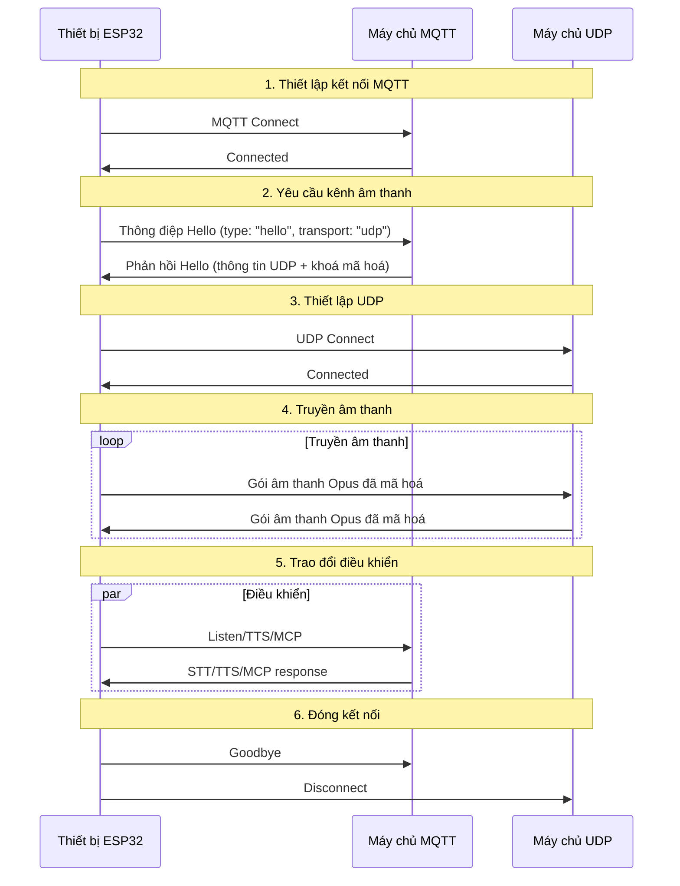
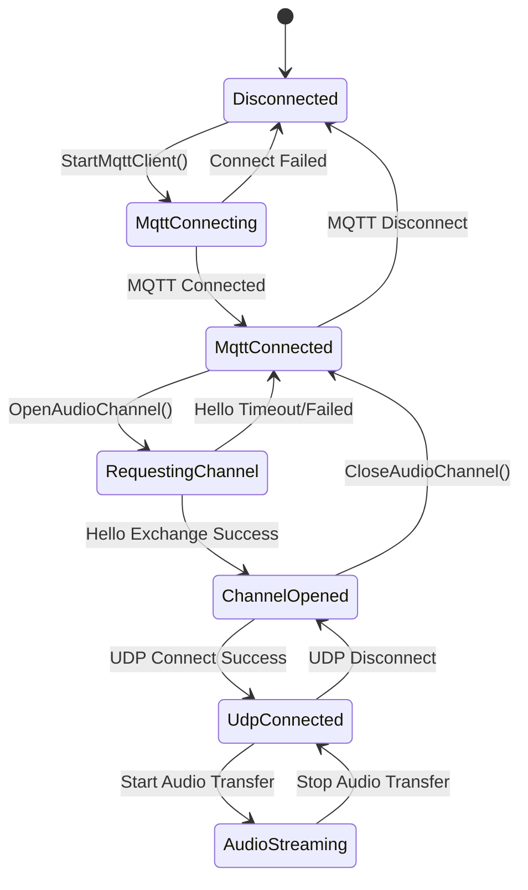

# Tài liệu giao thức truyền thông kết hợp MQTT + UDP

Tài liệu này tổng hợp từ mã nguồn, mô tả cách thiết bị và máy chủ trao đổi thông điệp: dùng MQTT cho điều khiển và đồng bộ trạng thái, dùng UDP để truyền âm thanh thời gian thực.

---

## 1. Tổng quan giao thức

Giao thức sử dụng hai kênh truyền song song:
- **MQTT**: truyền thông điệp điều khiển, đồng bộ trạng thái, dữ liệu JSON
- **UDP**: truyền dữ liệu âm thanh thời gian thực, có hỗ trợ mã hoá

### 1.1 Đặc điểm

- **Hai kênh tách biệt**: tách điều khiển và dữ liệu để đảm bảo độ trễ thấp
- **Truyền mã hoá**: âm thanh UDP dùng AES-CTR
- **Bảo vệ bằng số thứ tự**: chống phát lại và lệch thứ tự gói tin
- **Tự động kết nối lại**: MQTT tự tái kết nối khi rớt mạng

---

## 2. Luồng tổng quát



---

## 3. Kênh điều khiển MQTT

### 3.1 Thiết lập kết nối

Thiết bị kết nối đến máy chủ MQTT với các tham số:
- **Endpoint**: địa chỉ và cổng máy chủ MQTT
- **Client ID**: định danh duy nhất của thiết bị
- **Username/Password**: thông tin xác thực
- **Keep Alive**: chu kỳ heartbeat (mặc định 240 giây)

### 3.2 Trao đổi thông điệp Hello

#### 3.2.1 Thiết bị gửi Hello

```json
{
  "type": "hello",
  "version": 3,
  "transport": "udp",
  "features": {
    "mcp": true
  },
  "audio_params": {
    "format": "opus",
    "sample_rate": 16000,
    "channels": 1,
    "frame_duration": 60
  }
}
```

#### 3.2.2 Máy chủ phản hồi Hello

```json
{
  "type": "hello",
  "transport": "udp",
  "session_id": "xxx",
  "audio_params": {
    "format": "opus",
    "sample_rate": 24000,
    "channels": 1,
    "frame_duration": 60
  },
  "udp": {
    "server": "192.168.1.100",
    "port": 8888,
    "key": "0123456789ABCDEF0123456789ABCDEF",
    "nonce": "0123456789ABCDEF0123456789ABCDEF"
  }
}
```

**Giải thích:**
- `udp.server`: địa chỉ máy chủ UDP
- `udp.port`: cổng UDP
- `udp.key`: khoá AES (hex)
- `udp.nonce`: số ngẫu nhiên AES (hex)

### 3.3 Các loại thông điệp JSON

#### 3.3.1 Từ thiết bị lên máy chủ

1. **Listen**
   ```json
   {
     "session_id": "xxx",
     "type": "listen",
     "state": "start",
     "mode": "manual"
   }
   ```

2. **Abort**
   ```json
   {
     "session_id": "xxx",
     "type": "abort",
     "reason": "wake_word_detected"
   }
   ```

3. **MCP**
   ```json
   {
     "session_id": "xxx",
     "type": "mcp",
     "payload": {
       "jsonrpc": "2.0",
       "id": 1,
       "result": {...}
     }
   }
   ```

4. **Goodbye**
   ```json
   {
     "session_id": "xxx",
     "type": "goodbye"
   }
   ```

#### 3.3.2 Từ máy chủ xuống thiết bị

Các loại thông điệp tương tự giao thức WebSocket, gồm:
- **STT**: kết quả nhận dạng giọng nói
- **TTS**: điều khiển tổng hợp giọng nói
- **LLM**: điều khiển biểu cảm
- **MCP**: điều khiển IoT
- **System**: điều khiển hệ thống
- **Custom**: thông điệp tuỳ chỉnh (tuỳ chọn)

---

## 4. Kênh âm thanh UDP

### 4.1 Thiết lập

Sau khi nhận phản hồi Hello, thiết bị:
1. Lấy địa chỉ/cổng UDP
2. Lấy khoá và nonce mã hoá
3. Khởi tạo AES-CTR
4. Thiết lập kết nối UDP

### 4.2 Định dạng dữ liệu âm thanh

#### 4.2.1 Cấu trúc gói mã hoá

```
|type 1byte|flags 1byte|payload_len 2bytes|ssrc 4bytes|timestamp 4bytes|sequence 4bytes|
|payload payload_len bytes|
```

**Giải thích:**
- `type`: loại gói, cố định 0x01
- `flags`: cờ, hiện chưa dùng
- `payload_len`: độ dài payload (network order)
- `ssrc`: định danh nguồn đồng bộ
- `timestamp`: dấu thời gian (network order)
- `sequence`: số thứ tự (network order)
- `payload`: dữ liệu âm thanh Opus đã mã hoá

#### 4.2.2 Thuật toán mã hoá

Sử dụng **AES-CTR**:
- **Khoá**: 128-bit từ server
- **Nonce**: 128-bit từ server
- **Counter**: kết hợp timestamp và sequence

### 4.3 Quản lý số thứ tự

- **Thiết bị gửi**: `local_sequence_` tăng dần
- **Thiết bị nhận**: `remote_sequence_` kiểm tra liên tục
- **Chống phát lại**: loại bỏ gói có sequence nhỏ hơn mong đợi
- **Chịu lỗi**: chấp nhận bước nhảy nhỏ và ghi log cảnh báo

### 4.4 Xử lý lỗi

1. **Giải mã thất bại**: ghi lỗi, bỏ gói
2. **Sequence bất thường**: ghi cảnh báo, vẫn xử lý
3. **Định dạng sai**: ghi lỗi, bỏ gói

---

## 5. Quản lý trạng thái

### 5.1 Sơ đồ trạng thái



### 5.2 Kiểm tra trạng thái

Thiết bị xác định kênh âm thanh có khả dụng không bằng:

```cpp
bool IsAudioChannelOpened() const {
    return udp_ != nullptr && !error_occurred_ && !IsTimeout();
}
```

---

## 6. Tham số cấu hình

### 6.1 Cấu hình MQTT

Đọc từ phần cài đặt:
- `endpoint`: địa chỉ MQTT
- `client_id`: ID client
- `username`: tên đăng nhập
- `password`: mật khẩu
- `keepalive`: heartbeat (mặc định 240 giây)
- `publish_topic`: topic xuất bản

### 6.2 Tham số âm thanh

- **Định dạng**: Opus
- **Tần số lấy mẫu**: 16000 Hz (thiết bị) / 24000 Hz (server)
- **Số kênh**: 1 (mono)
- **Độ dài khung**: 60 ms

---

## 7. Xử lý lỗi và tái kết nối

### 7.1 Cơ chế MQTT

- Tự động thử lại khi kết nối thất bại
- Hỗ trợ báo lỗi lên lớp điều khiển
- Khi mất kết nối sẽ kích hoạt quy trình dọn dẹp

### 7.2 Quản lý UDP

- Không tự tái kết nối nếu thất bại
- Dựa vào MQTT để đàm phán lại
- Có API kiểm tra trạng thái

### 7.3 Xử lý timeout

Lớp cơ sở `Protocol` cung cấp kiểm tra timeout:
- Thời gian mặc định: 120 giây
- Tính theo thời điểm nhận gói gần nhất
- Hết thời gian sẽ đánh dấu kênh không khả dụng

---

## 8. Bảo mật

### 8.1 Mã hoá truyền tải

- **MQTT**: hỗ trợ TLS/SSL (cổng 8883)
- **UDP**: dùng AES-CTR cho dữ liệu âm thanh

### 8.2 Cơ chế xác thực

- **MQTT**: xác thực username/password
- **UDP**: phân phối khoá thông qua kênh MQTT

### 8.3 Chống phát lại

- Sequence tăng dần
- Từ chối gói hết hạn
- Kiểm tra timestamp