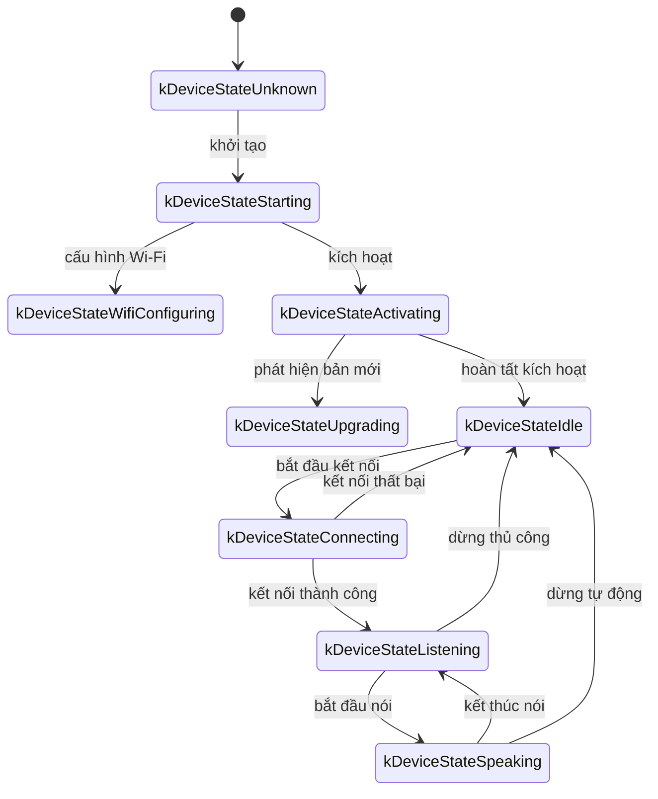
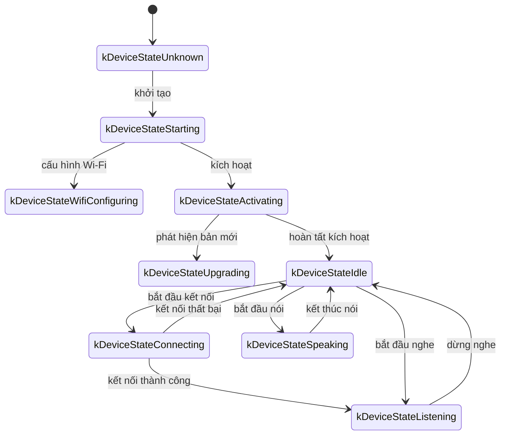

# Tài liệu giao thức WebSocket

Tài liệu này tổng hợp dựa trên mã nguồn để mô tả giao thức WebSocket giữa thiết bị và máy chủ. Khi triển khai thực tế, hãy đối chiếu với dịch vụ phía máy chủ để bổ sung chi tiết nếu cần.

---

## 1. Tổng quan quy trình

1. **Khởi tạo thiết bị**
   - Khi bật nguồn, lớp `Application` khởi tạo:
     - Codec âm thanh, màn hình, LED...
     - Kết nối mạng
     - Tạo instance `WebsocketProtocol` (hiện thực `Protocol`)
   - Thiết bị vào vòng lặp chính, chờ sự kiện (âm thanh vào/ra, tác vụ nền...).

2. **Tạo kết nối WebSocket**
   - Khi cần bắt đầu phiên thoại (ví dụ đánh thức, nhấn nút), gọi `OpenAudioChannel()`:
     - Lấy URL WebSocket từ cấu hình
     - Thiết lập header (`Authorization`, `Protocol-Version`, `Device-Id`, `Client-Id`)
     - Gọi `Connect()` để bắt tay với máy chủ

3. **Thiết bị gửi thông điệp "hello"**
   - Sau khi kết nối thành công, thiết bị gửi JSON:
   ```json
   {
     "type": "hello",
     "version": 1,
     "features": {
       "mcp": true
     },
     "transport": "websocket",
     "audio_params": {
       "format": "opus",
       "sample_rate": 16000,
       "channels": 1,
       "frame_duration": 60
     }
   }
   ```
   - `features` tuỳ chọn, sinh ra theo cấu hình biên dịch (vd `"mcp": true`).
   - `frame_duration` tương ứng `OPUS_FRAME_DURATION_MS` (thường 60ms).

4. **Máy chủ phản hồi "hello"**
   - Thiết bị chờ JSON chứa `"type": "hello"` và `"transport": "websocket"`.
   - Máy chủ có thể trả `session_id`, thiết bị sẽ lưu lại.
   - Ví dụ:
   ```json
   {
     "type": "hello",
     "transport": "websocket",
     "session_id": "xxx",
     "audio_params": {
       "format": "opus",
       "sample_rate": 24000,
       "channels": 1,
       "frame_duration": 60
     }
   }
   ```
   - Nếu đúng định dạng, âm thanh được coi là sẵn sàng. Nếu quá 10 giây không nhận được phản hồi hợp lệ, coi như lỗi mạng.

5. **Trao đổi dữ liệu tiếp theo**
   - Hai loại dữ liệu chính:
     1. **Khung nhị phân âm thanh** (Opus)
     2. **Thông điệp JSON** (trạng thái trò chuyện, STT/TTS, MCP...)
   - Trong callback nhận dữ liệu:
     - `binary = true`: coi là âm thanh Opus để giải mã.
     - `binary = false`: coi là JSON, parse bằng cJSON để xử lý (chat, TTS, MCP...).
   - Khi mạng hoặc máy chủ ngắt, `OnDisconnected()` được gọi và thiết bị trở về trạng thái chờ.

6. **Đóng kết nối**
   - Khi phiên thoại kết thúc, thiết bị gọi `CloseAudioChannel()` để đóng kết nối và quay lại trạng thái rảnh.

---

## 2. Header chung

Khi bắt tay WebSocket, thiết bị gửi các header:

- `Authorization`: token truy cập dạng `Bearer <token>`
- `Protocol-Version`: phiên bản giao thức, trùng với `version` trong thông điệp hello
- `Device-Id`: địa chỉ MAC
- `Client-Id`: UUID phần mềm (reset khi xoá NVS hoặc flash lại toàn bộ)

Máy chủ có thể dùng các header này để xác thực.

---

## 3. Phiên bản giao thức nhị phân

Phiên bản được chỉ định qua trường `version` trong cấu hình.

### 3.1 Version 1 (mặc định)
Gửi trực tiếp dữ liệu Opus, không có metadata.

### 3.2 Version 2
Cấu trúc `BinaryProtocol2`:
```c
struct BinaryProtocol2 {
    uint16_t version;
    uint16_t type;       // 0: OPUS, 1: JSON
    uint32_t reserved;
    uint32_t timestamp;  // mili giây, phục vụ AEC phía server
    uint32_t payload_size;
    uint8_t payload[];
} __attribute__((packed));
```

### 3.3 Version 3
Cấu trúc `BinaryProtocol3`:
```c
struct BinaryProtocol3 {
    uint8_t type;
    uint8_t reserved;
    uint16_t payload_size;
    uint8_t payload[];
} __attribute__((packed));
```

---

## 4. Cấu trúc thông điệp JSON

Text frame dùng JSON, các giá trị `type` phổ biến:

### 4.1 Thiết bị → Máy chủ

1. **Hello**: gửi sau khi kết nối, cung cấp tham số cơ bản.
2. **Listen**: báo bắt đầu/kết thúc ghi âm.
   - Trường thường dùng:
     - `session_id`
     - `type = "listen"`
     - `state = "start" | "stop" | "detect"`
     - `mode = "auto" | "manual" | "realtime"`
   - Ví dụ bắt đầu nghe:
     ```json
     {
       "session_id": "xxx",
       "type": "listen",
       "state": "start",
       "mode": "manual"
     }
     ```
3. **Abort**: ngừng phát TTS hoặc đóng kênh.
4. **Wake Word Detected**: thông báo phát hiện từ đánh thức; có thể gửi kèm âm thanh để nhận diện giọng nói.
   ```json
   {
     "session_id": "xxx",
     "type": "listen",
     "state": "detect",
     "text": "你好小明"
   }
   ```
5. **MCP**: gửi thông điệp MCP (JSON-RPC 2.0). Ví dụ phản hồi `result`:
   ```json
   {
     "session_id": "xxx",
     "type": "mcp",
     "payload": {
       "jsonrpc": "2.0",
       "id": 1,
       "result": {
         "content": [
           { "type": "text", "text": "true" }
         ],
         "isError": false
       }
     }
   }
   ```

### 4.2 Máy chủ → Thiết bị

1. **Hello**: phản hồi handshake.
2. **STT**: kết quả nhận dạng lời nói.
3. **LLM**: điều khiển biểu cảm/emoji.
4. **TTS**: điều khiển phát âm thanh (`state = start/stop/sentence_start`).
5. **MCP**: yêu cầu điều khiển IoT. Ví dụ `tools/call`:
   ```json
   {
     "session_id": "xxx",
     "type": "mcp",
     "payload": {
       "jsonrpc": "2.0",
       "method": "tools/call",
       "params": {
         "name": "self.light.set_rgb",
         "arguments": { "r": 255, "g": 0, "b": 0 }
       },
       "id": 1
     }
   }
   ```
6. **System**: lệnh hệ thống (vd `"command": "reboot"`).
7. **Custom**: thông điệp tuỳ biến (khi bật `CONFIG_RECEIVE_CUSTOM_MESSAGE`).
8. **Khung âm thanh nhị phân**: server gửi Opus để thiết bị phát; khi đang ghi âm có thể bỏ qua để tránh xung đột.

---

## 5. Mã hoá/giải mã âm thanh

1. **Thiết bị gửi**: tín hiệu microphone sau xử lý (AEC, NR, AGC...) được mã hoá Opus và gửi đi.
2. **Thiết bị nhận**: nhận khung nhị phân → giải mã Opus → phát ra loa. Nếu tần số khác nhau sẽ resample.

---

## 6. Dòng trạng thái phổ biến

1. **Idle → Connecting**: người dùng kích hoạt → `OpenAudioChannel()` → gửi `hello`.
2. **Connecting → Listening**: kết nối thành công và gọi `SendStartListening(...)`.
3. **Listening → Speaking**: nhận `{"type":"tts","state":"start"}` → dừng ghi âm, phát TTS.
4. **Speaking → Idle**: nhận `{"type":"tts","state":"stop"}`; nếu không tự quay lại listening thì về Idle.
5. **Listening/Speaking → Idle**: gọi `SendAbortSpeaking(...)` hoặc `CloseAudioChannel()`.

### Sơ đồ trạng thái chế độ tự động


### Sơ đồ trạng thái chế độ thủ công


---

## 7. Xử lý lỗi

1. **Kết nối thất bại**: nếu `Connect(url)` lỗi hoặc timeout chờ `hello`, gọi `on_network_error_()`.
2. **Máy chủ ngắt kết nối**: callback `OnDisconnected()` → gọi `on_audio_channel_closed_()` → chuyển về Idle hoặc logic retry.

---

## 8. Lưu ý khác

1. **Xác thực**: token trong header `Authorization`; server nên kiểm tra hạn dùng.
2. **Quản lý phiên**: `session_id` giúp phân biệt cuộc hội thoại.
3. **Âm thanh**: mặc định Opus 16kHz mono; server có thể gửi 24kHz để nghe nhạc tốt hơn.
4. **Phiên bản nhị phân**: tuỳ nhu cầu chọn version 1/2/3.
5. **Ưu tiên MCP**: nên dùng type `"mcp"` cho điều khiển IoT (type `"iot"` cũ đã bỏ).
6. **JSON lỗi**: thiếu trường quan trọng sẽ bị log lỗi và bỏ qua.

---

## 9. Ví dụ trao đổi

1. **Thiết bị → Máy chủ** (handshake)
   ```json
   {
     "type": "hello",
     "version": 1,
     "features": {
       "mcp": true
     },
     "transport": "websocket",
     "audio_params": {
       "format": "opus",
       "sample_rate": 16000,
       "channels": 1,
       "frame_duration": 60
     }
   }
   ```

2. **Máy chủ → Thiết bị** (phản hồi handshake)
   ```json
   {
     "type": "hello",
     "transport": "websocket",
     "session_id": "xxx",
     "audio_params": {
       "format": "opus",
       "sample_rate": 16000
     }
   }
   ```

3. **Thiết bị → Máy chủ** (bắt đầu nghe)
   ```json
   {
     "session_id": "xxx",
     "type": "listen",
     "state": "start",
     "mode": "auto"
   }
   ```

4. **Máy chủ → Thiết bị** (kết quả ASR)
   ```json
   {
     "session_id": "xxx",
     "type": "stt",
     "text": "用户说的话"
   }
   ```

5. **Máy chủ → Thiết bị** (TTS bắt đầu)
   ```json
   {
     "session_id": "xxx",
     "type": "tts",
     "state": "start"
   }
   ```

6. **Máy chủ → Thiết bị** (TTS kết thúc)
   ```json
   {
     "session_id": "xxx",
     "type": "tts",
     "state": "stop"
   }
   ```
Thiết bị dừng phát âm thanh và quay lại trạng thái rảnh nếu không có yêu cầu khác.

---

## 10. Tổng kết

Giao thức WebSocket cung cấp kênh truyền JSON và khung âm thanh Opus song song, hỗ trợ các chức năng: truyền âm thanh lên, phát TTS, STT, quản lý trạng thái và điều khiển MCP. Điểm cốt lõi:

- **Bắt tay**: gửi/nhận `hello`
- **Âm thanh**: khung Opus hai chiều, nhiều phiên bản nhị phân
- **JSON**: `type` xác định ý nghĩa (TTS, STT, MCP, WakeWord, System, Custom...)
- **Mở rộng**: có thể bổ sung trường JSON hoặc header để đáp ứng nhu cầu thực tế

Máy chủ và thiết bị cần thống nhất ý nghĩa trường, thứ tự và xử lý lỗi để giao tiếp ổn định. Tài liệu này có thể dùng làm nền tảng cho việc tích hợp và mở rộng sau này.